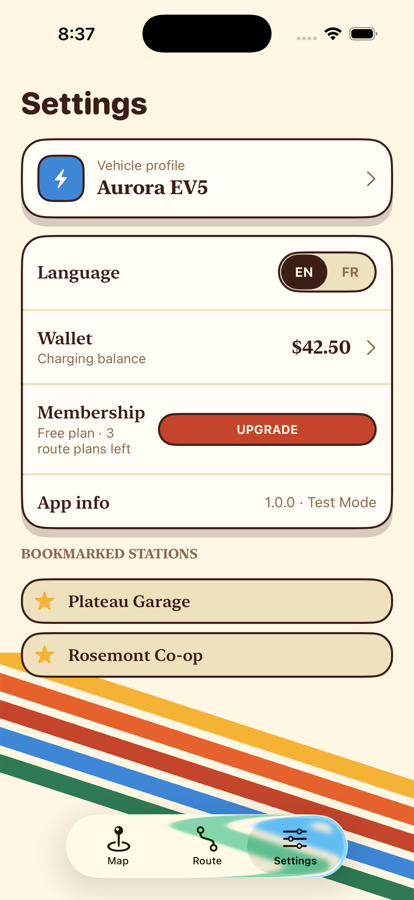

# ChargePath

A retro-styled iOS EV-charging app — find stations on a **real map**, check
live port status, plan road trips with charging stops, and run a mocked
activate → live-session → receipt charging flow that bills a wallet balance.
English + French.

Built as a **programmatic UIKit** app (no storyboard, no SwiftUI) with an
**MVVM + Coordinator + Repository** architecture and constructor dependency
injection throughout. Wired to **ChargeHub's REST API** — auth, decoding and
the live-status merge are verified against the real service; because the free
tier serves only a fixed sample, the running app is driven by
identically-shaped seed data ([full detail](#data--chargehub-api)).
38 unit tests, Dynamic Type + VoiceOver support.

| Map | Station detail | Route planner | Settings |
|---|---|---|---|
|  |  |  |  |

### The charging flow

Pick a port → confirm the $25 hold → watch the live meter → stop → receipt.
The wallet is really debited (`−$1.79` here), and a **Charging** banner rides
the map until the session ends.

| Pick a port | Confirm ($25 hold) | Live session | Receipt | Wallet debit | Map banner |
|---|---|---|---|---|---|
|  |  |  |  |  |  |

---

## How it works, screen by screen

### 1 · Map  — `MapViewController` / `MapViewModel` / `MapCoordinator`

A full-bleed **real `MKMapView`**. Charging stations are `MKAnnotation`s at
real latitude/longitude (a gold "bolt" pin, grey when every port is offline,
orange when selected). Floating over the map: a search field, an All /
Bookmarked morphing toggle, and a filter button.

- Panning/zooming the map → `MapViewModel.regionChanged` → (debounced 400 ms)
  → `StationRepository.loadStations(in:)` → ChargeHub fetch.
- `visibleStations` is `combineLatest(stations, filter, bookmarks, vehicle,
  userLocation)` run through `StationFilter.matches(…)` — a 1:1 port of the
  design mockup's `visible()` predicate (connector set, availability, charging
  speed, radius, compatible-with-my-car, hide-offline, text search).
- A "locate me" button (bottom-right) recentres on the user location from
  the injected `LocationService`, whose `CLLocation` also feeds the distance
  sort. This build wires in **`FixedLocationService`** — a fixed Montréal
  position, no permission prompt — so the seeded Montréal stations always
  fall inside the default search radius and the map is populated the instant
  anyone clones and runs it, on any simulator or device. `SystemLocationService`
  (real `CLLocationManager`) is in the same file, one line away in
  `DependencyContainer`. If a fetch genuinely fails (no key / network) a slim
  banner says "showing sample data".
- Tapping a pin opens **Station detail** as a bottom sheet. The visible map
  area shrinks to the band above the sheet and re-centres on the pin
  (`MapViewController.focus(on:sheetHeight:)`), reproducing the mockup's
  `mapBottom` / `mapPan` behaviour. Tapping a **different** pin while the
  sheet is open re-points the same sheet at the new station.
- While a charging session is running, an ink **"Charging · {station} · {port}"**
  banner sits above the locate button (`MapViewModel.activeSessionBanner`,
  driven by `ChargingSessionRepository.activeSession`); tapping it reopens the
  live **Active session** screen.

### 2 · Station detail  — `StationDetailViewController` / `StationDetailViewModel`

A `UISheetPresentationController` bottom sheet with `.medium()` / `.large()`
detents; the map stays interactive behind the medium detent.

- On appear the sheet shows a "checking live status" state, calls
  `StationRepository.refreshLiveStatus(for:)` (ChargeHub Status endpoint),
  then flips to "Live" and re-renders the port rows with real
  **Available / In use / Offline** badges.
- Connector badges highlight the one that fits the selected vehicle
  ("NACS · fits your car").
- The star toggles a bookmark (persisted); "Start charging" opens the
  Activate flow.

### 3 · Activate charging  — `ActivateChargingViewController` / `ActivateChargingViewModel`

Full-screen flow presented over the sheet, two steps bound to `viewModel.step`:

1. **Select port** — offline ports excluded, radio-style selection
2. **Confirm** — station / port / rate summary + a **$25 pre-auth hold** line
   and a "sandbox card 4242" note. `confirmPayment()` calls
   `ChargingSessionRepository.startSession(station:port:)`, which:
   - checks the **wallet balance** covers the $25 hold — if not, the step
     shows *"Your balance is $X — a $25 hold is needed to start"* plus an
     **Add funds** button that dismisses into the Wallet screen;
   - authorises the hold via the **mocked** `PaymentAuthService`;
   - creates the one app-wide `ActiveChargingSession` and starts its meter.

On success the flow dismisses straight to the **Active session** screen — there
is no third "success" step. No real payment is ever taken.

### 3a · Active session  — `ActiveSessionViewController` / `ActiveSessionViewModel`

A full-screen (`isModalInPresentation`) live meter, driven entirely by
`ChargingSessionRepository.activeSession`:

- **Charging state** — pulsing gold bolt disc + `TEST MODE` badge, and four
  metric cards: **Elapsed**, **Energy** (kWh), **Cost so far**
  (`energy × rate + $1 session fee`), **Power** (the port's kW). A `Timer` in
  the repository advances a *simulated, time-compressed* meter (1 real second
  ≈ 120 charging seconds) so a session runs its course in a few seconds.
- **Stop** — the dark "Stop charging" button calls `stopSession()`, which
  settles the **real energy cost against the wallet** (`WalletRepository.charge`,
  a debit row in payment history), releases the hold, clears the active
  session, and returns a `ChargingSessionReceipt`.
- **Receipt state** — Energy / Duration / Rate / **Total charged** rows and a
  "Back to map" button. The session also **auto-stops** when it reaches a
  plausible target top-up for that port; the repository broadcasts the receipt
  on `finishedReceipt`, so an auto-stop lands on the same receipt screen as a
  manual stop rather than just closing.

While a session is live, **"Start charging" is disabled** on every Station
Detail sheet (*"Finish your current session first"*) — there is only ever one
session, enforced by `ChargingSessionError.sessionAlreadyActive`.

Screenshots (top of this file): [live session](docs/screenshots/session-live.png)
→ [receipt](docs/screenshots/session-receipt.png) →
[the `−$1.79` debit in the Wallet](docs/screenshots/wallet.png).

### 4 · Route planner  — `RoutePlannerViewController` / `RoutePlannerViewModel` / `RouteRepository`

Two-stage flow (`viewModel.stage`):

- **Input** — start / destination fields (geocodable defaults pre-filled),
  a vehicle-profile card whose range auto-fills from the selected vehicle,
  and a "Plan trip" button.
- **Results** — a real `MKMapView` with the driving polyline and numbered
  stop pins, plus a list of `RouteStopRowView`s (station, "km in · kW ·
  arrive %", estimated minutes). Tapping a stop jumps to the Map tab and
  opens that station.

Planning = geocode → `MKDirections` route → greedy charging-stop insertion.
See **[Route planner accuracy](#route-planner--what-it-computes-and-how-accurate-it-is)** below for exactly how good the numbers are.

### 5 · Settings  — `SettingsViewController` / `SettingsViewModel` / `SettingsCoordinator`

- **Vehicle profile** row → pushes **Vehicle selection** (screen 6)
- **Language** EN / FR `MorphingToggleView` → `LocalizationRepository`
  switches the whole app's copy live (no relaunch)
- **Wallet** row (shows the balance) → pushes the Wallet screen
- **App info** — version · Test Mode
- **Bookmarked stations** list — tapping one jumps to the Map tab and opens it

**Wallet:** dark balance card, top-up chips ($10 / $25 / $50), "Add $N ·
Test Mode" (mock sandbox top-up, appends a credit to history), payment
history. State persisted via `WalletRepository`.

### 6 · Vehicle selection  — `VehicleSelectionViewController` / `VehicleSelectionViewModel`

Connector-compatible vehicle picker (gold = selected, with a filled radio
dot) plus "or pick a connector" chips. Reached from both Settings and the
Route Planner; writes through `VehicleRepository` (persisted).

---

## Architecture

### Layers

```
App/              AppDelegate, SceneDelegate, DependencyContainer (composition root)
Models/           pure value types — Station, ChargingPort, Vehicle, StationFilter,
                  RoutePlan, Wallet, ActiveChargingSession, ChargingSessionReceipt
Services/         the outside world — ChargeHub REST API (Alamofire), CLGeocoder,
                  MKDirections, location (fixed Montréal by default, real
                  CLLocationManager swappable), UserDefaults wrapper, mocked
                  payment authorization, the one shared Alamofire Session,
                  offline seed data
Repositories/     the domain API the ViewModels consume — combine services,
                  cache, fall back to seed data, expose state as Rx Observables
ViewModels/       one per screen — BehaviorRelay outputs, `on…` closure hooks
                  for navigation; never construct their own dependencies
ViewControllers/  programmatic UIKit; every value arrives through an Rx binding
Coordinators/     AppCoordinator + one per tab; build each screen from the
                  container and own all navigation
Theme/            AppColor / AppFont / AppMetrics / Strings (EN + FR)
Views/            reusable design-system components
Resources/        Assets.xcassets + chargehub-*-sample.json (seed data in the
                  real ChargeHub JSON shape, decoded via the same DTOs)
Config/           Base.xcconfig + Secrets.xcconfig (API key — see below)

ChargePathTests/  38 XCTest cases + in-memory protocol doubles
```

### Dependency injection

Nothing reaches for its own dependencies. **`DependencyContainer`** is the one
composition root:

1. constructs the real **Services** once,
2. wires them into the real **Repositories** once (these hold shared state —
   the bookmark set, the wallet, the station cache — so there is exactly one
   of each),
3. exposes a factory per screen that builds a **fresh ViewModel** from those
   shared repositories.

Coordinators call the container when they navigate; ViewControllers receive a
ready-made ViewModel and construct nothing.

```swift
final class MapViewModel {
    private let stationRepository: StationRepository
    private let bookmarkRepository: BookmarkRepository
    // …
    init(stationRepository: StationRepository,
         bookmarkRepository: BookmarkRepository, …) { … }   // everything injected
}
```

### Singletons

Exactly one: **`HTTPSession.shared`** — a single configured Alamofire
`Session` (one connection pool / `URLCache` per process, no meaningful
alternative). Services, Repositories and ViewModels are always injected
instances so they stay swappable and testable.

### Data flow (Map)

```
MKMapView pan ─▶ MapViewModel.regionChanged ─(debounce 400ms)▶ StationRepository
                                                                     │
                            ChargeHubStationService ◀────────────────┘
                                     │ Alamofire → DTO → domain Station
                                     ▼
              BehaviorRelay<[Station]>  ──combineLatest(filter, bookmarks,
                                          vehicle, userLocation)──▶  visibleStations
                                     │ .bind / subscribe
                                     ▼
                          MapViewController plots annotations
```

All ViewModel → UI wiring is **RxSwift `BehaviorRelay` + `.bind(to:)` /
subscriptions** — no `reloadData()` / text-setting outside a binding.

---

## Design

A deliberately retro, single-look design system (it does **not** invert for
Dark Mode — the cream/ink identity is the point). Tokens live in `Theme/`.

### Palette (`AppColor`)

| Token | Hex | Role |
|---|---|---|
| Cream | `#FFF6E3` | primary surface |
| Ink | `#3B1F17` | text, 2 pt borders, hard shadow |
| Gold | `#F5B335` | selected / primary accent |
| Orange | `#E5622D` | call-to-action buttons |
| Rust | `#C4452C` | tags, gradient base |
| Sky | `#3E86D6` | route / info |
| Available | `#2F7A55` | live "available" status |
| Sand | `#EFE0BE` | inset tracks, muted fills |

### Type (`AppFont`)

The mockup uses *Bagel Fat One* (rounded display) + *Zilla Slab* (slab
titles) + system body. Font files aren't bundled, so these are approximated
with the system **rounded** and **serif** faces — swap real `UIFont`s into
`AppFont` to match exactly.

### Motifs (`Views/`)

- **Diagonal tricolor stripe** behind Route Planner & Settings
  (`StripeBackgroundView`), tilted ±18°
- **Hard offset shadow** (no blur) on every raised surface (`applyHardShadow`)
- **Ink outline** ~2 pt on nearly everything; pill radii are clamped in
  `layoutSubviews` (`roundCornersAsPill`) and small filled tiles clip to
  their radius (`applyInkOutline(clip:)`)
- **Morphing toggle** — an ink pill slides behind the selected label with a
  spring (`MorphingToggleView`)
- **Bottom sheets**, not full-page pushes, for Station Detail & Filters
- 8-pt spacing grid, 44 pt minimum tap target (`AppMetrics`)

### Localization

Full EN + FR copy is a 1:1 port of the mockup, held in `Theme/Strings.swift`
(not `.strings` files) so the Settings toggle switches the whole app live.

### Accessibility

Every face in `AppFont` is scaled with `UIFontMetrics` and labels opt into
`adjustsFontForContentSizeCategory`, so the UI respects Dynamic Type.
Icon-only controls (filter, locate, bookmark, close) and the map pins carry
`accessibilityLabel` / `accessibilityValue` for VoiceOver.

---

## Data — ChargeHub API

Station locations and live port status are wired to ChargeHub's REST API
(`Services/ChargeHubEndpoint`, `ChargeHubDTO`, `ChargeHubStationService`).
This section is deliberately blunt about what is real, what is a fixed sample,
and what was reverse-engineered — because the honest version matters more than
a "uses a live API" line.

### Add your API key

1. Get a key: <https://developer.chargehub.com> → subscribe to the free demo
   product (**Demo - POI**) → your **Profile** → copy the **Primary key**.
2. Create your local secrets file (git-ignored — never committed or pushed):
   ```sh
   cp Config/Secrets.example.xcconfig Config/Secrets.xcconfig
   ```
3. Paste the key in — no quotes:
   ```
   CHARGEHUB_API_KEY = your_primary_key
   ```
4. Rebuild.

`Config/Base.xcconfig` (attached to the target) `#include?`s that file and
surfaces the value into `Info.plist`; `APIConfig` reads it there, and also
accepts a `CHARGEHUB_API_KEY` environment variable as a fallback. With **no**
key the app runs entirely on seed data (below).

### The two calls

| Call | Request | Response |
|---|---|---|
| Stations | `GET https://apiv3.chargehub.com/demo/locations` | bare JSON array — `LocID, LocName, Latitude, Longitude, Ports[{PortID, Level, KW, ChargingCostDisplay, Connectors}]` |
| Live status | `GET …/demo/status?locId={id}` | array of `{LocID, PortID, StatusCode, StatusTime}` |

Auth is the `Ocp-Apim-Subscription-Key` header (ChargeHub sits behind Azure
API Management). `StatusCode` maps to `PortStatus` (**1 = available,
2 = in use, 3 = offline**) and drives the coloured port badges on the Station
Detail sheet. The response DTOs decode leniently — every field optional, and
`Connectors` is accepted as either `["A","B"]` or `[["A","B"]]`.

### What's verified vs. what's assumed

**Verified** — with a real key I confirmed, via `curl` and the app's `OSLog`
(subsystem `com.chargepath.app`, category `StationRepository`):

- `GET /demo/locations` → **HTTP 200**, header auth accepted, body decodes
  through `[ChargeHubStationDTO]` → `Station` — logs *"ChargeHub returned N
  stations"*.
- `GET /demo/status` → **HTTP 200**, decodes through `ChargeHubStatusResponse`,
  merges onto the open station — logs *"ChargeHub status: N port record(s)"*.

So the transport, header auth, JSON decoding, `StatusCode` merge and the
seed-fallback logic are all exercised against the live service.

**Assumed / reverse-engineered** — I did not have a full published spec:

- Endpoint paths and the `status` query shape came from the portal's operation
  screenshots + probing, not a spec document. `ChargeHubEndpoint` carries a
  code comment saying as much ("path is a best guess — confirm against the
  portal's Status operation").
- The exact JSON keys were inferred from sample responses; that's *why* the
  DTOs are defensive about missing/renamed fields.

### What the demo key actually returns

ChargeHub documents **Demo - POI** as a *sample* product (the paid **Trial -
POI** tier is the one described as giving real coverage and bounding-box
queries). What I observed by calling it:

- **Every** `GET /demo/locations` returns the **same single station** — one
  site in Temecula, CA, ~2021 data — regardless of any location parameter.
- `GET /demo/status` returns **one fixed, unrelated** port record.
- Rate limit ~5 req/min, 100/week; the `networks` operation returns 401 on
  this product.

I did **not** find a doc sentence stating "you get exactly one station" — it's
the empirical behaviour of the sample dataset. Either way, the app can't
build a map on it.

### So the app runs on ChargeHub-shaped seed data

`StationRepository` fires the live call on every map pan, logs that it
round-tripped, then — because the demo result has fewer stations than the
bundled set — **keeps the seed set**. The seed set is also the fallback with
no key and with no network, so the app is **fully functional offline**.

The seed is **not** hand-built domain objects — it's
`Resources/chargehub-locations-sample.json` + `chargehub-status-sample.json`
in the **exact JSON shape** ChargeHub returns (real Montréal coordinates),
decoded through the **same `ChargeHubStationDTO` / `ChargeHubStatusResponse`
pipeline** as live data, `StatusCode` merge included. Map, Station Detail and
Route Planner were all verified end-to-end against that ChargeHub-shaped JSON.

**Bottom line:** the integration layer (auth, request building, decoding,
status merge, graceful fallback) is real and tested against the live service;
the *live dataset* is a fixed sample by ChargeHub's design, so the running app
is driven by identically-shaped seed data. Moving to real nationwide data is a
base-URL swap to the paid tier plus adding the bounding-box params in
`ChargeHubEndpoint` — no other code changes.

---

## Route planner — what it computes, and how accurate it is

`RouteRepository.planTrip(_:)`:

1. **Geocode** origin + destination (`CLGeocoder`)
2. **Driving route** between them (`MKDirections`) → real polyline + distance
3. **Insert charging stops** greedily: usable range per leg is
   `(SoC − 15 % reserve) × vehicleRange`; start at 100 %, assume a recharge to
   90 % at each stop; drop a stop at ~90 % of each leg budget and pick the
   **nearest connector-compatible station** to that point on the route
4. Per stop: estimated **arrival SoC %** (linear consumption) and **charge
   minutes** (`energyNeeded ÷ power × 60 × 1.15`, ~5 km/kWh)

| Part | Accuracy |
|---|---|
| Route line + total distance | **Accurate** — real `MKDirections` output |
| Where stops land | **Rough** — flat efficiency, no elevation / weather / speed / HVAC; assumes exactly 100 → 90 % cycles |
| Which station is chosen | **Limited** — candidate pool is only the seed stations (+ region cache), not a corridor-wide charger DB. A paid data tier fixes this. |
| Arrival SoC % | Ballpark — consistent with the model, but the model is linear (no regen, no climate load) |
| Charge minutes | **Under-estimate** — ignores the charging curve (real DC slows sharply above ~70 %); order-of-magnitude only |
| Offline fallback (`demoPlan`) | Fixed illustrative numbers — used when geocoding / directions fail or exceed the 15 s timeout |

It's a genuine greedy planner that demonstrates the feature; it is **not**
trip-planning-grade and isn't meant to be.

---

## Test Mode

The pre-auth hold is **mocked** (`MockPaymentAuthService`) and Wallet top-ups
are simulated sandbox credits — no real payment is ever taken. The charging
*meter* is a time-compressed simulation, not a real OCPP session. What **is**
real: the wallet is genuinely debited for `energy × rate + session fee` when a
session stops, and the balance is checked before a session can start. The
"App info" row and several badges say *Test Mode* so this is never ambiguous.

## Tests

`ChargePathTests` — **38 XCTest cases**, all passing, built on the injected
protocols (in-memory doubles in `ChargePathTests/Doubles.swift`):

```sh
xcodebuild test -project ChargePath.xcodeproj -scheme ChargePath \
  -sdk iphonesimulator -destination 'platform=iOS Simulator,name=iPhone 17 Pro'
```

| Suite | Covers |
|---|---|
| `StationFilterTests` | every rule of `StationFilter.matches` (segment, connectors, availability, power, radius, compatible-only, query) |
| `ConnectorTests` | lenient plug parsing (`"J1772 Combo"` → CCS, `"Tesla"` → NACS), `StatusCode` → `PortStatus` |
| `ChargeHubDTOTests` | decoding the real ChargeHub `/demo/locations` + `/demo/status` JSON → domain, and the bundled seed JSON |
| `MapViewModelTests` | the `combineLatest` visible-stations pipeline, segment/query filtering, `onAppear`/`locateTapped` → `LocationService` |
| `StationDetailViewModelTests` | live-status merge → `.live`, `present(_:)` re-point, bookmark write-through, "start" disabled while a session runs |
| `RouteRepositoryTests` | real-plan stop insertion never below the 15 % reserve; geocode-failure → `isEstimate` fallback |
| `WalletTests` | `addFunds` balance + history, amount formatting, non-positive guard |
| `WalletChargeTests` | `charge(_:title:subtitle:)` debits the balance + prepends a debit row; non-positive guard |
| `ChargingSessionRepositoryTests` | insufficient funds → `.insufficientFunds`; start publishes the session; stop settles the wallet and clears it; stop with no session → `.noActiveSession`; `parseRate` from the price string; a stop broadcasts the receipt on `finishedReceipt` (so an auto-stop shows it too) |

---

## Build & run

**Requirements:** Xcode 26 / iOS 26.5 SDK, deployment target **iOS 17.0**.
SPM resolves dependencies on first open.

**In Xcode:** `open ChargePath.xcodeproj`, pick a simulator, ⌘R.

**From the command line (simulator):**

```sh
# 1. build for the simulator
xcodebuild -project ChargePath.xcodeproj -scheme ChargePath \
  -sdk iphonesimulator -destination 'platform=iOS Simulator,name=iPhone 17 Pro' build

# 2. boot a simulator and open the Simulator app
xcrun simctl list devices available | grep iPhone   # see what's installed
xcrun simctl boot "iPhone 17 Pro"
open -a Simulator

# 3. install + launch the build
APP=$(find ~/Library/Developer/Xcode/DerivedData \
  -path '*Debug-iphonesimulator/ChargePath.app' -maxdepth 6 -type d | head -1)
xcrun simctl install "iPhone 17 Pro" "$APP"
xcrun simctl launch "iPhone 17 Pro" Jainder.ChargePath

# watch the ChargeHub calls
xcrun simctl spawn "iPhone 17 Pro" log stream --level info \
  --predicate 'subsystem == "com.chargepath.app"'
```

Running on a **physical iPhone** additionally needs Xcode + your Apple ID for
code signing.

### Dependencies (SPM)

| Package | Version | Use |
|---|---|---|
| Alamofire | 5.12 | networking (`APIClient` over the shared `Session`) |
| RxSwift / RxCocoa | 6.10 | ViewModel ↔ UI binding (`BehaviorRelay` + `.bind(to:)`) |

`Package.resolved` is committed to pin exact versions.

---

## Known limitations / what a v2 would add

- **Real charger corridor data** for route planning (paid ChargeHub tier) and
  a charge-curve model instead of the linear consumption estimate.
- **Custom fonts** — bundle *Bagel Fat One* / *Zilla Slab* instead of the
  system rounded/serif approximation.
- **Persistence** is `UserDefaults` via `KeyValueStore`; a real build would
  move the wallet/bookmarks to something sturdier.
- **A real charging session** — OCPP/OCPI start-stop against the charger, an
  Apple Pay / PSP pre-auth in place of `MockPaymentAuthService`, and a real
  meter feed instead of the time-compressed simulation.
- **UI / snapshot tests** — the current 38 tests are logic/ViewModel only.
