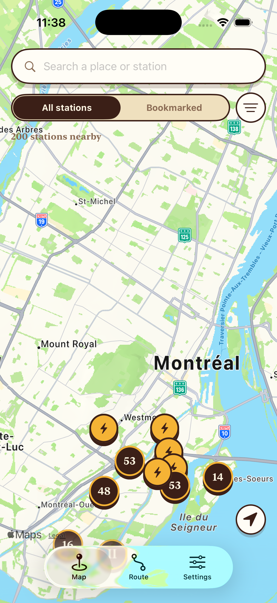
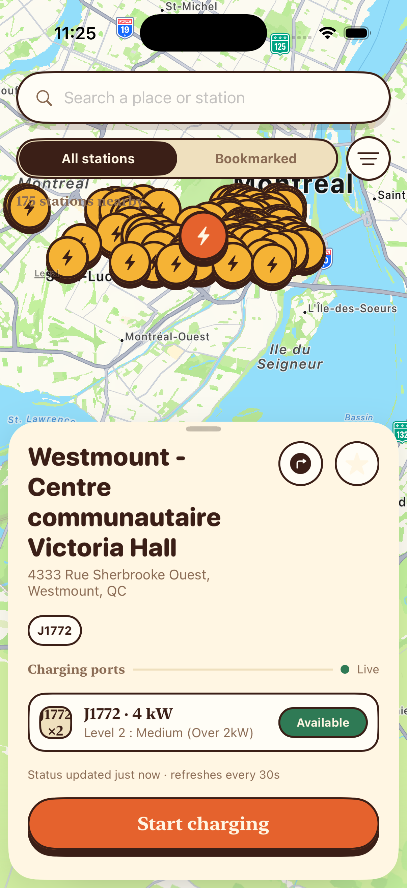
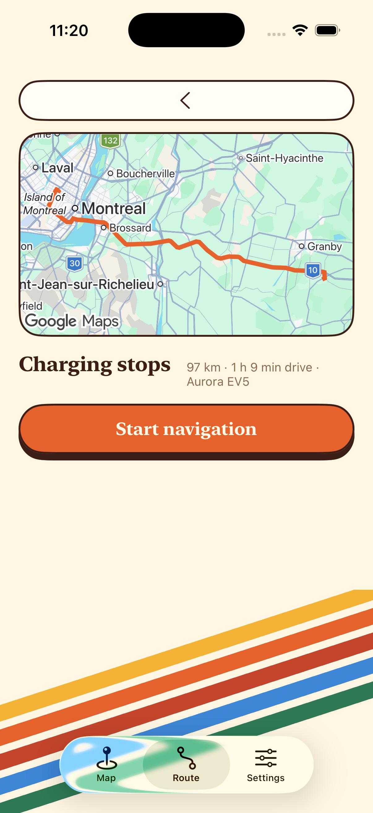
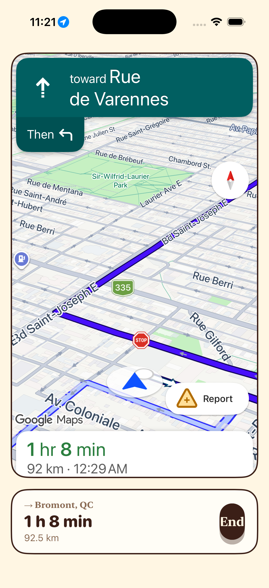
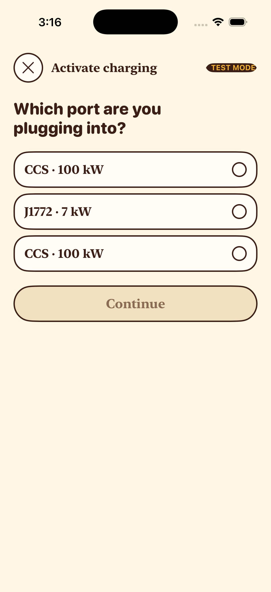
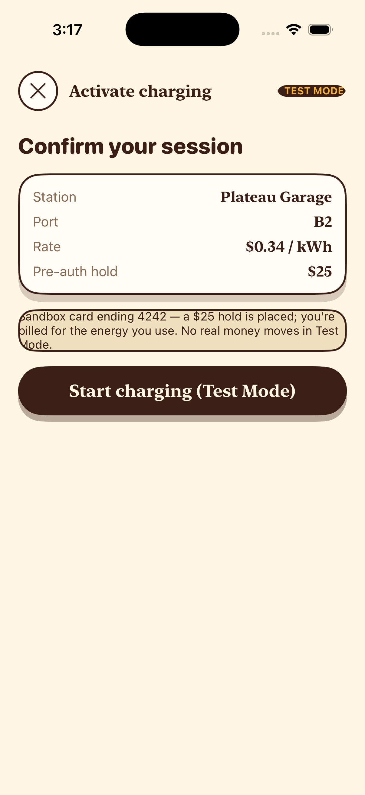
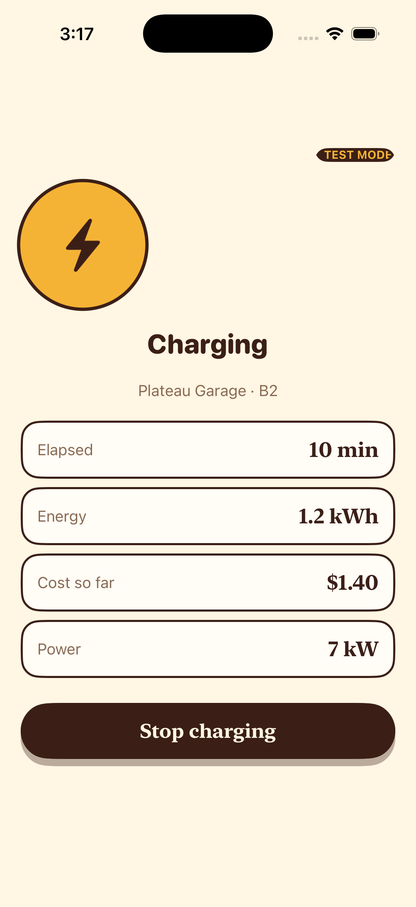
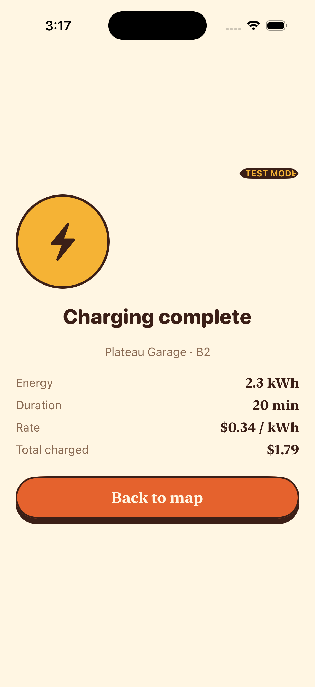
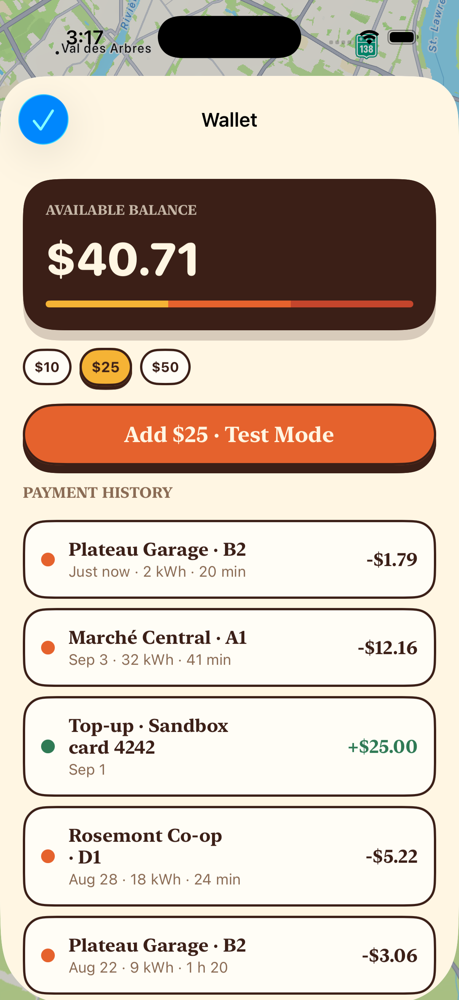
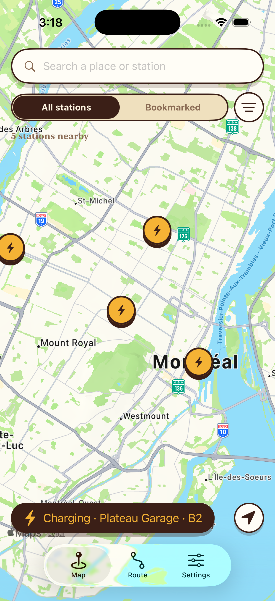

# ChargePath

A retro-styled iOS EV-charging app — find real charging stations on a map,
check port status, plan road trips with charging stops, get **in-app
turn-by-turn navigation**, and run a mocked activate → live-session → receipt
charging flow that bills a wallet balance. English + French.

Built as a **programmatic UIKit** app (no storyboard, no SwiftUI) with an
**MVVM + Coordinator + Repository** architecture and constructor dependency
injection throughout:

- **Live station data** from [Open Charge Map](https://openchargemap.org) —
  an open, community-run global EV-charger registry (bounding-box POI queries,
  connector / power / operator / price). A second `StationService`
  implementation talks to **ChargeHub's REST API** as a worked example of the
  same seam.
- **In-app turn-by-turn navigation** via the **Google Navigation SDK for
  iOS** — origin → charging stops → destination as waypoints, voice guidance,
  live rerouting.
- **Route preview** (polyline, charging-stop insertion, traffic-aware ETA) via
  MapKit `MKDirections`.

46 unit tests, Dynamic Type + VoiceOver support.

| Map | Station detail | Route planner | Navigation |
|---|---|---|---|
|  |  |  |  |

Map pins cluster into a numbered badge wherever real Open Charge Map density
would otherwise pile pins on top of each other (`StationClusterAnnotationView`);
tapping a cluster zooms into it.

### The charging flow

Pick a port → confirm the $25 hold → watch the live meter → stop → receipt.
The wallet is really debited (`−$1.79` here), and a **Charging** banner rides
the map until the session ends.

| Pick a port | Confirm ($25 hold) | Live session | Receipt | Wallet debit | Map banner |
|---|---|---|---|---|---|
|  |  |  |  |  |  |

---

## How it works, screen by screen

### 1 · Map — `MapViewController` / `MapViewModel` / `MapCoordinator`

A full-bleed **real `MKMapView`**. Charging stations are `MKAnnotation`s at
real latitude/longitude (a gold "bolt" pin, grey when every port is offline,
orange when selected). Pins close enough on screen to overlap — routine with
real Open Charge Map density — collapse into a numbered ink badge
(`StationClusterAnnotationView`, MapKit's built-in clustering); tapping one
zooms into it. Floating over the map: a search field, an All / Bookmarked
morphing toggle, and a filter button.

- Panning/zooming → `MapViewModel.regionChanged` → (debounced 400 ms) →
  `StationRepository.loadStations(in:)` → **Open Charge Map** POI fetch for the
  visible bounding box. Any non-empty result replaces the previous set; an
  empty result (ocean, unmapped area) or a failure falls back to the bundled
  seed, and a slim banner says "showing sample data".
- `visibleStations` is `combineLatest(stations, filter, bookmarks, vehicle,
  userLocation)` run through `StationFilter.matches(…)` (connector set,
  availability, charging speed, radius, compatible-with-my-car, hide-offline,
  text search).
- A "locate me" button recentres on the user location from the injected
  `LocationService`, whose `CLLocation` also feeds the distance sort. This
  build wires in **`FixedLocationService`** (a fixed Montréal position, no
  permission prompt) so the map is populated the instant anyone clones and
  runs it; `SystemLocationService` (real `CLLocationManager`) is in the same
  file, one line away in `DependencyContainer`.
- Tapping a pin opens **Station detail** as a bottom sheet; the map area
  shrinks to the band above the sheet and re-centres on the pin
  (`MapViewController.focus(on:sheetHeight:)`). Tapping a **different** pin
  while the sheet is open re-points the same sheet.
- While a charging session runs, an ink **"Charging · {station} · {port}"**
  banner sits above the locate button and reopens the live **Active session**
  screen on tap.

### 2 · Station detail — `StationDetailViewController` / `StationDetailViewModel`

A `UISheetPresentationController` bottom sheet with `.medium()` / `.large()`
detents; the map stays interactive behind the medium detent.

- On appear it shows a "checking live status" state, calls
  `StationRepository.refreshLiveStatus(for:)`, then flips to "Live" and
  re-renders the port rows with **Available / In use / Offline** badges.
  (Open Charge Map publishes no live per-port occupancy feed, so with OCM data
  the badge reflects the station's operational flag; the ChargeHub service
  refines real per-port `StatusCode`s.)
- Connector badges highlight the one that fits the selected vehicle
  ("NACS · fits your car").
- **Directions** starts in-app turn-by-turn straight to this station; the star
  toggles a persisted bookmark; **Start charging** opens the Activate flow.

### 3 · Activate charging — `ActivateChargingViewController` / `ActivateChargingViewModel`

Full-screen flow presented over the sheet, two steps bound to `viewModel.step`:

1. **Select port** — offline ports excluded, radio-style selection
2. **Confirm** — station / port / rate summary + a **$25 pre-auth hold** line
   and a "sandbox card 4242" note. `confirmPayment()` calls
   `ChargingSessionRepository.startSession(station:port:)`, which:
   - checks the **wallet balance** covers the $25 hold — if not, the step
     shows *"Your balance is $X — a $25 hold is needed to start"* plus an
     **Add funds** button that dismisses into the Wallet screen;
   - authorises the hold via the **mocked** `PaymentAuthService`;
   - creates the one app-wide `ActiveChargingSession` and starts its meter.

On success the flow dismisses straight to the **Active session** screen. No
real payment is ever taken.

### 3a · Active session — `ActiveSessionViewController` / `ActiveSessionViewModel`

A full-screen live meter, driven entirely by
`ChargingSessionRepository.activeSession`:

- **Charging state** — pulsing gold bolt disc + `TEST MODE` badge, and four
  metric cards: **Elapsed**, **Energy** (kWh), **Cost so far**
  (`energy × rate + $1 session fee`), **Power** (the port's kW). A `Timer` in
  the repository advances a *simulated, time-compressed* meter (1 real second
  ≈ 120 charging seconds) so a session runs its course in a few seconds.
- **Stop** — settles the **real energy cost against the wallet**
  (`WalletRepository.charge`, a debit row in payment history), releases the
  hold, clears the active session, and returns a `ChargingSessionReceipt`.
- **Receipt state** — Energy / Duration / Rate / **Total charged** rows and a
  "Back to map" button. The session also **auto-stops** at a plausible target
  top-up; the repository broadcasts the receipt on `finishedReceipt`, so an
  auto-stop lands on the same receipt screen as a manual stop.

While a session is live, **"Start charging" is disabled** on every Station
Detail sheet — there is only ever one session, enforced by
`ChargingSessionError.sessionAlreadyActive`.

### 4 · Route planner — `RoutePlannerViewController` / `RoutePlannerViewModel` / `RouteRepository`

Two-stage flow (`viewModel.stage`):

- **Input** — start / destination fields (geocodable defaults pre-filled),
  a vehicle-profile card whose range auto-fills from the selected vehicle,
  and a "Plan trip" button.
- **Results** — a real `MKMapView` with the driving polyline and numbered stop
  pins, a meta line (`312 km · 4 h 12 min drive · 4 h 46 min with charging ·
  {vehicle}` — the drive time is `MKDirections`' traffic-aware ETA), a list of
  `RouteStopRowView`s, and a **Start navigation** button that opens the
  in-app turn-by-turn screen for the whole trip. Tapping a stop jumps to the
  Map tab and opens that station.

Planning = geocode (`CLGeocoder`) → `MKDirections` route → greedy
charging-stop insertion. See
**[Route planner accuracy](#route-planner--what-it-computes-and-how-accurate-it-is)**.

### 5 · Navigation — `NavigationViewController` / `NavigationViewModel`

Full-screen in-app turn-by-turn, presented from **Start navigation** (whole
trip: charging stops then destination) or from a station's **Directions**
button (single destination).

- The map area is the **Google Navigation SDK**'s view, which renders its own
  maneuver header + footer and drives voice guidance and rerouting. ChargePath
  wraps a themed ETA / distance strip and an **End** button around it.
- `NavigationViewModel` owns the ordered `[NavWaypoint]` and talks only to a
  **`TurnByTurnNavigator`** protocol; `GoogleTurnByTurnNavigator` is the
  concrete implementation, compiled only when the SDK is linked
  (`#if canImport(GoogleNavigation)`). Without the SDK — or without a
  `GOOGLE_MAPS_API_KEY` — the screen shows a themed placeholder and the rest
  of the app is unaffected.
- Google's terms-of-service dialog is shown once (the SDK refuses to start
  guidance until it's accepted); the SDK uses a real location fix, hence the
  `NSLocation*UsageDescription` keys and the `location` / `audio` background
  modes in `Info.plist`.

See **[Navigation setup & billing](#navigation--google-navigation-sdk)**.

### 6 · Settings — `SettingsViewController` / `SettingsViewModel` / `SettingsCoordinator`

- **Vehicle profile** row → pushes **Vehicle selection**
- **Language** EN / FR `MorphingToggleView` → `LocalizationRepository` switches
  the whole app's copy live (no relaunch)
- **Wallet** row (shows the balance) → pushes the Wallet screen
- **App info** — version · Test Mode
- **Bookmarked stations** list — tapping one jumps to the Map tab and opens it

**Wallet:** dark balance card, top-up chips ($10 / $25 / $50), "Add $N ·
Test Mode" (mock sandbox top-up), payment history. Persisted via
`WalletRepository`.

### 7 · Vehicle selection — `VehicleSelectionViewController` / `VehicleSelectionViewModel`

Connector-compatible vehicle picker plus "or pick a connector" chips. Reached
from both Settings and the Route Planner; writes through `VehicleRepository`
(persisted).

---

## Architecture

### Layers

```
App/              AppDelegate (provides the Google Maps API key), SceneDelegate,
                  DependencyContainer (composition root)
Models/           pure value types — Station, ChargingPort, Vehicle, StationFilter,
                  RoutePlan, NavWaypoint, Wallet, ActiveChargingSession, …
Services/         the outside world — Open Charge Map + ChargeHub REST (Alamofire),
                  CLGeocoder, MKDirections, TurnByTurnNavigator (Google Navigation
                  SDK behind the seam), location, UserDefaults wrapper, mocked
                  payment auth, the one shared Alamofire Session, offline seed data
Repositories/     the domain API the ViewModels consume — combine services, cache,
                  fall back to seed data, expose state as Rx Observables
ViewModels/       one per screen — BehaviorRelay outputs, `on…` closure hooks for
                  navigation; never construct their own dependencies; no UIKit /
                  vendor-SDK imports
ViewControllers/  programmatic UIKit; every value arrives through an Rx binding
Coordinators/     AppCoordinator + one per tab; build each screen from the
                  container and own all navigation
Theme/            AppColor / AppFont / AppMetrics / Strings (EN + FR)
Views/            reusable design-system components
Resources/        Assets.xcassets + seed station JSON (offline fallback)
Config/           Base.xcconfig + Secrets.xcconfig (API keys — see below)

ChargePathTests/  46 XCTest cases + in-memory protocol doubles
```

### Dependency injection

Nothing reaches for its own dependencies. **`DependencyContainer`** is the one
composition root:

1. constructs the real **Services** once,
2. wires them into the real **Repositories** once (these hold shared state —
   the bookmark set, the wallet, the station cache — so there is exactly one
   of each),
3. exposes a factory per screen that builds a **fresh ViewModel** from those
   shared repositories.

Coordinators call the container when they navigate; ViewControllers receive a
ready-made ViewModel and construct nothing. The one pragmatic exception is the
Navigation screen: `GMSMapView` and its `navigator` are inseparable, so
`NavigationViewController` creates the map view (via `NavigationEngine.make()`)
and hands the resulting `TurnByTurnNavigator` to its ViewModel through
`bind(navigator:)`.

### Singletons

Exactly one app-owned singleton: **`HTTPSession.shared`** — a single configured
Alamofire `Session`. (`GMSServices` is a vendor singleton initialised once in
`AppDelegate`.) Services, Repositories and ViewModels are always injected
instances so they stay swappable and testable.

### Data flow (Map)

```
MKMapView pan ─▶ MapViewModel.regionChanged ─(debounce 400ms)▶ StationRepository
                                                                     │
                        OpenChargeMapStationService ◀────────────────┘
                                     │ Alamofire → OCM DTO → domain Station
                                     ▼
              BehaviorRelay<[Station]>  ──combineLatest(filter, bookmarks,
                                          vehicle, userLocation)──▶  visibleStations
                                     │ .bind / subscribe
                                     ▼
                          MapViewController plots annotations
```

All ViewModel → UI wiring is **RxSwift `BehaviorRelay` + `.bind(to:)` /
subscriptions** — no `reloadData()` / text-setting outside a binding.

---

## Data — Open Charge Map

Live station data comes from Open Charge Map (`Services/OpenChargeMapEndpoint`,
`OpenChargeMapDTO`, `OpenChargeMapStationService`).

### Add your key

1. Sign in at <https://openchargemap.org> → **My Profile** → **My Apps** →
   register an app → copy the **API key**. (OCM also serves keyless traffic,
   just heavily rate-limited.)
2. Create your local secrets file (git-ignored):
   ```sh
   cp Config/Secrets.example.xcconfig Config/Secrets.xcconfig
   ```
3. Fill it in — no quotes:
   ```
   OPEN_CHARGE_MAP_API_KEY = your_key
   ```
4. Rebuild.

`Config/Base.xcconfig` `#include?`s that file and surfaces the values into
`Info.plist`; `APIConfig` reads them there, with a same-named environment
variable as a fallback. With **no** key the app still calls OCM (rate-limited)
and falls back to the seed on failure.

### The call

`GET https://api.openchargemap.io/v3/poi?output=json&verbose=false&maxresults=200&boundingbox=(minLat,minLon),(maxLat,maxLon)`
— the bounding box is derived from the visible `MKCoordinateRegion`; auth is
the `key` query param (also sent as the `X-API-Key` header). The response is a
bare JSON array; `OCMPoiDTO.toDomain()` maps `AddressInfo` → name/coords,
`Connections[]` → `ChargingPort`s (connector title via `Connector(apiValue:)`,
`PowerKW`, operational flag → `PortStatus`), and `UsageCost` → the price
string. Decoding is lenient — OCM is community-edited, so every field is
optional. Connector titles OCM uses but the `Connector` enum has no case for
(`Type 2`, `CHAdeMO`) map to `.unknown`.

### ChargeHub (second worked example)

`ChargeHubStationService` implements the same `StationService` protocol against
ChargeHub's REST API (`Ocp-Apim-Subscription-Key` header auth,
`/demo/locations` + `/demo/status`, `StatusCode` → `PortStatus` merge). It is
kept as a demonstration of the seam; ChargeHub's free **Demo - POI** tier
returns a single fixed POI regardless of location, which is why it isn't the
default `stationService` in `DependencyContainer`. Set `CHARGEHUB_API_KEY` in
`Secrets.xcconfig` if you want to exercise it.

### Offline seed

`Resources/chargehub-locations-sample.json` + `chargehub-status-sample.json`
(real Montréal coordinates) are the fallback with no network / an empty OCM
result. `StationSeed` decodes them through the ChargeHub DTO pipeline, so the
Map / Station Detail / Route flows all work fully offline.

---

## Navigation — Google Navigation SDK

`NavigationViewModel` drives a `TurnByTurnNavigator`; `GoogleTurnByTurnNavigator`
(in `Services/GoogleTurnByTurnNavigator.swift`, guarded by
`#if canImport(GoogleNavigation)`) wraps `GMSMapView` + `GMSNavigator`. The
route waypoints are the planned **charging stops followed by the destination**
(or a single station); the drive always starts from the live GPS fix.

### Add your key

1. In the [Google Cloud console](https://console.cloud.google.com): create a
   project, **enable billing**, and enable both **Navigation SDK for iOS** and
   **Maps SDK for iOS**. Create an **API key**.
2. Put it in `Config/Secrets.xcconfig`:
   ```
   GOOGLE_MAPS_API_KEY = your_key
   ```
3. The SPM package (`https://github.com/googlemaps/ios-navigation-sdk`, pinned
   to `11.1.0`) is already in the project; SPM resolves it on first build.
4. Rebuild. `AppDelegate` calls `GMSServices.provideAPIKey(_:)` at launch when
   the key is present. Empty key ⇒ the Navigation screen shows a placeholder.

### Billing

The Navigation SDK is a **paid** Google Maps Platform product. Free tier is
≈ **1,000 destination requests / month**; each `setDestinations(...)` (i.e.
each time you start navigating a route) is one destination request. Starting
guidance and rerouting on an already-fetched destination are **not** extra
charges. Watch usage in the Cloud console → *Maps Platform → Metrics /
Billing*. The SDK binary also adds ~100 MB to the build before stripping.

### Notes

- Some Cloud projects must **request Navigation SDK access** before the key
  works, even with billing on — a `403` at `setDestinations` is the tell.
- Simulator guidance needs a moving location: Xcode **Features ▸ Location ▸
  Freeway Drive**, or a GPX file.

---

## Route planner — what it computes, and how accurate it is

`RouteRepository.planTrip(_:)`:

1. **Geocode** origin + destination (`CLGeocoder`)
2. **Driving route** between them (`MKDirections`) → real polyline, distance,
   and **traffic-aware ETA** (`MKRoute.expectedTravelTime`)
3. **Insert charging stops** greedily: usable range per leg is
   `(SoC − 15 % reserve) × vehicleRange`; start at 100 %, assume a recharge to
   90 % at each stop; drop a stop at ~90 % of each leg budget and pick the
   **nearest connector-compatible station** to that point on the route
4. Per stop: estimated **arrival SoC %** (linear consumption) and **charge
   minutes** (`energyNeeded ÷ power × 60 × 1.15`, ~5 km/kWh)

| Part | Accuracy |
|---|---|
| Route line, distance, drive-time ETA | **Accurate** — real `MKDirections` output, ETA factors current traffic |
| Where stops land | **Rough** — flat efficiency, no elevation / weather / speed / HVAC; assumes exactly 100 → 90 % cycles |
| Which station is chosen | **Limited** — candidate pool is the OCM region cache + seed, not a corridor-wide charger DB |
| Arrival SoC % | Ballpark — linear model (no regen, no climate load) |
| Charge minutes | **Under-estimate** — ignores the charging curve |
| Offline fallback (`demoPlan`) | Fixed illustrative numbers — used when geocoding / directions fail or exceed the 15 s timeout |

The **actual guided drive** is handed to the Google Navigation SDK, which does
its own routing and live traffic; the greedy planner above is the preview and
the charging-stop picker feeding it waypoints.

---

## Test Mode

The pre-auth hold is **mocked** (`MockPaymentAuthService`) and Wallet top-ups
are simulated sandbox credits — no real payment is ever taken. The charging
*meter* is a time-compressed simulation, not a real OCPP session. What **is**
real: the wallet is genuinely debited for `energy × rate + session fee` when a
session stops, and the balance is checked before a session can start.

## Tests

`ChargePathTests` — **46 XCTest cases**, all passing, built on the injected
protocols (in-memory doubles in `ChargePathTests/Doubles.swift`):

```sh
xcodebuild test -project ChargePath.xcodeproj -scheme ChargePath \
  -sdk iphonesimulator -destination 'platform=iOS Simulator,name=iPhone 17 Pro'
```

| Suite | Covers |
|---|---|
| `StationFilterTests` | every rule of `StationFilter.matches` |
| `ConnectorTests` | lenient plug parsing, `StatusCode` → `PortStatus` |
| `OpenChargeMapDTOTests` | OCM `/v3/poi` JSON → domain (connectors, power, price, operational flag, rows without coords dropped) |
| `ChargeHubDTOTests` | ChargeHub `/demo/*` JSON → domain, and the bundled seed JSON |
| `MapViewModelTests` | the `combineLatest` visible-stations pipeline, segment/query filtering, location hooks |
| `StationDetailViewModelTests` | live-status merge, `present(_:)` re-point, bookmark write-through, "start" disabled during a session |
| `RouteRepositoryTests` | real-plan stop insertion never below the 15 % reserve; drive-time carried through; geocode-failure → `isEstimate` fallback |
| `NavigationViewModelTests` | waypoint order (stops → destination), guidance start/stop, nav updates → ETA/distance text, arrival, unavailable-navigator placeholder |
| `WalletTests` / `WalletChargeTests` | balance + history, amount formatting, non-positive guards |
| `ChargingSessionRepositoryTests` | funds check, start/stop settlement, receipt broadcast |

---

## Build & run

**Requirements:** Xcode 26 / iOS 26.5 SDK, deployment target **iOS 17.0**
(the Navigation SDK needs iOS 16+). SPM resolves dependencies on first open.

**In Xcode:** `open ChargePath.xcodeproj`, pick a simulator, ⌘R.

**From the command line (simulator):**

```sh
xcodebuild -project ChargePath.xcodeproj -scheme ChargePath \
  -sdk iphonesimulator -destination 'platform=iOS Simulator,name=iPhone 17 Pro' build

xcrun simctl boot "iPhone 17 Pro"; open -a Simulator
APP=$(find ~/Library/Developer/Xcode/DerivedData \
  -path '*Debug-iphonesimulator/ChargePath.app' -maxdepth 6 -type d | head -1)
xcrun simctl install "iPhone 17 Pro" "$APP"
xcrun simctl launch "iPhone 17 Pro" Jainder.ChargePath

# watch the station-fetch log
xcrun simctl spawn "iPhone 17 Pro" log stream --level info \
  --predicate 'subsystem == "com.chargepath.app"'
```

### Dependencies (SPM)

| Package | Version | Use |
|---|---|---|
| Alamofire | 5.12 | networking (`APIClient` over the shared `Session`) |
| RxSwift / RxCocoa | 6.10 | ViewModel ↔ UI binding |
| GoogleNavigation (+ GoogleMaps) | 11.1.0 | in-app turn-by-turn navigation |

`Package.resolved` is committed to pin exact versions.

---

## Known limitations / what a v2 would add

- **`Connector` cases for Type 2 / CHAdeMO** — OCM reports them but the enum
  currently folds them into `.unknown` (adding cases ripples into `Strings` +
  the filter UI).
- **Corridor-wide charger data** for route planning instead of the region
  cache + seed, and a charge-curve model instead of the linear estimate.
- **Custom fonts** — bundle *Bagel Fat One* / *Zilla Slab* instead of the
  system rounded/serif approximation.
- **Persistence** is `UserDefaults` via `KeyValueStore`; a real build would
  move the wallet/bookmarks to something sturdier.
- **A real charging session** — OCPP/OCPI start-stop, an Apple Pay / PSP
  pre-auth in place of `MockPaymentAuthService`, a real meter feed.
- **UI / snapshot tests** — the current suite is logic/ViewModel only.
